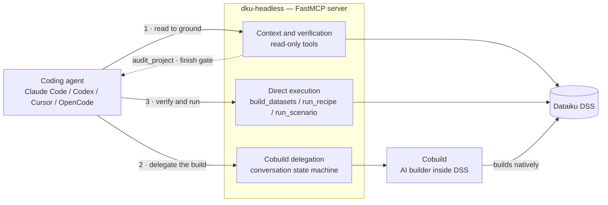

<div align="center">

<picture>
  <source media="(prefers-color-scheme: dark)" srcset="docs/assets/senryu-bird-white.svg">
  
</picture>

<h1><code>$&nbsp;dku-headless</code></h1>

<p><strong>The Dataiku Cobuild supervisor kit</strong><br>
<sub>a Senryu Labs sub-brand · <a href="https://www.dataiku.com">Dataiku</a></sub></p>

<p><code>SUPERVISE&nbsp;·&nbsp;DELEGATE&nbsp;·&nbsp;VERIFY</code></p>

<p>
  <a href="LICENSE"></a>
  
  <a href="https://github.com/dataiku/dku-headless/actions/workflows/ci.yml"></a>
  <a href="https://gofastmcp.com"></a>
</p>

</div>

---

**`dku-headless` connects a coding agent — Claude Code, Codex, Cursor, OpenCode, or any
custom MCP client — to a Dataiku DSS instance and gives it a deliberately narrow job:
supervise Cobuild.**

Your agent reads the project to ground itself, hands each unit of building to **Cobuild** —
the AI builder that runs *inside* DSS — and then verifies the result with its own reads. The
agent does not hand-build the flow; DSS builds it, natively and reviewably, and your agent
stays accountable for what lands. The division of labor is the whole point:

<div align="center">

**gather context** → **delegate the build to Cobuild** → **verify independently** → **execute directly only where Cobuild cannot**

</div>



The tool surface reflects that division of labor, and the routing rule is a capability rule,
not a list: in-project asset work routes through Cobuild; direct tools exist where Cobuild
cannot act — instance-level operations, cross-project operations, bootstrap actions that
precede a project or conversation, and deterministic execution of assets that already exist.
The direct surface grows only along those capability lines (instance administration, for
example) — never with in-project asset writes. Today's surface, by role:

- **Context & verification (read-only).** List, inspect, sample, and profile every object
  type — projects, flows, datasets, recipes, connections, scenarios, jobs, Data Quality,
  ML, agents, LLMs. Two composed tools do the heavy lifting: `get_project_overview`
  (one call instead of a `list_*` fan-out) and `get_flow_graph` (nodes, edges, and an
  ASCII build tree). Secret-like values are redacted from connection and project-variable
  reads, and `get_project_variables` hides local variables unless `include_local=true`.
  `audit_project` is the independent finish gate over the flow (datasets, recipes, zones,
  wiki).
- **Cobuild delegation — the build path.** Every in-project mutation (recipes, datasets,
  models, dashboards, scenarios, zones, wiki, deletions) is delegated through a Cobuild
  conversation. There are no direct `create_recipe` / `update_dataset` style write tools.
- **Direct execution.** Deterministic execution of assets that already exist — today that's
  `build_datasets`, `run_recipe`, `run_scenario`.
- **Bootstrap writes.** Writes Cobuild cannot do because they precede a project or
  conversation, or are file-uploads from the agent's own machine — today that's
  `create_project`, `create_upload_dataset` / `create_upload_dataset_from_rows`,
  `upload_file_to_managed_folder`, `write_project_library_file`.
- **Instance management.** `list_instances`, `switch_instance`, `get_current_instance` for
  driving multiple DSS instances from one agent.

`dataiku_mcp` is a [FastMCP](https://gofastmcp.com) server: every tool is a typed, async
MCP tool, all blocking DSS API calls run off an event loop, and long operations emit
progress notifications. Tools never accept an API key as an argument — authentication is
resolved server-side from environment variables or the request's bearer token.

## Install

Each plugin install wires up both `dataiku-skills/` and the MCP server in one step. Cloning
the repo works too — every config file the plugins reference (`.mcp.json`, `.cursor/mcp.json`,
`opencode.json`, `dataiku-skills/`) is a real file at the repo root.

### Claude Code

```
/plugin marketplace add dataiku/dku-headless
/plugin install dataiku@dataiku
```

### Codex

```
/plugins
```
Add the marketplace and install `dataiku` from there.

### Cursor

- **Auto-discovered:** `.cursor/mcp.json` at the repo root wires up the MCP tools with no
  install step.
- **Plugin** (adds the skill too): install the `dataiku` plugin from Cursor's Marketplace UI
  (Customize → Marketplace → search `dataiku`).

### OpenCode

**Auto-discovered:** `opencode.json` at the repo root wires up the MCP tools with no install
step.

### From source / standalone server

Clone the repo and run the server directly — only needed for direct testing, or for running
streamable-http as a standing service:

```bash
uv sync                    # create .venv and install with dependencies (Python 3.10+, uv)
./bin/run_mcp.sh           # uv run python -m dataiku_mcp
# or, from an installed package:
uvx dataiku-headless serve
```

Then set your Dataiku connection — see [Configure](#configure).

## How delegation works

A Cobuild turn can run for minutes, so delegation is a small state machine rather than a
blocking call:

1. **`start_cobuild_conversation(project_key)`** opens a thread and registers it durably.
   The returned `conversation_id` is the handle for everything that follows; it is persisted,
   so follow-ups keep working after the MCP server restarts.
2. **`send_cobuild_message(conversation_id, project_key, message, allow_edit_project=…, timeout_seconds=…)`**
   sends one instruction. `allow_edit_project` is a **per-message grant, default `false`** —
   inspection and planning run read-only, and you flip it `true` only on the message that
   carries an explicitly requested build.
3. **Timeout ≠ failure.** If a turn exceeds `timeout_seconds`, the tool returns
   `status: timeout` and *retains the work* in a background thread. Poll it with
   **`get_cobuild_turn_status`** — never re-send, which would double-run the build. Sending
   while a turn is already in flight returns `status: in_progress` instead of overlapping,
   including from another MCP process sharing the same state directory.
4. **Deletions require confirmation.** When Cobuild proposes a destructive change it returns
   `status: needs_confirmation` with the objects to delete and a `confirmation_id`. Inspect
   the objects, then
   **`answer_cobuild_confirmation(…, confirmation_id=…, choice="APPROVE"|"CANCEL")`**. Passing
   `confirmation_id` is **required** and must exact-match the pending confirmation — it is
   proof-of-inspection of *this* deletion, and it survives a restart because the durable store
   retains observed confirmation ids.
5. **`list_cobuild_conversations(project_key)`** rediscovers a project's conversations
   (and any pending confirmation / in-flight turn) after a restart.

Conversation metadata lives under `DKU_MCP_STATE_DIR` (see [Configure](#configure)); the
in-memory handles are only a hot cache. **What survives a restart:** the conversations and any
observed confirmation id. **What does not:** a turn that was still *running* — the in-flight
work is dropped and polling it reports `turn_lost`, so treat its outcome as unknown. A mutating
re-send is refused; inspect the project or use a read-only follow-up to recover first. The same
caution applies to a
connection-level failure mid-turn, reported as `error_kind: transport_outcome_unknown`: do not
blindly re-send. **Registry bounds:** `DKU_MCP_MAX_COBUILD_TURNS` (default `8`) caps how many turns
run *concurrently across processes sharing the state directory* — a send beyond it is refused
with `error_kind: saturated` rather than started.
Independently, settled turns are swept from memory once their outcome is persisted (and their total
is hard-capped), and a turn still running past a hard time ceiling is evicted with a persisted
`abandoned` outcome so it can never wedge a slot forever.

## Tool surface

One fixed surface — no exposure modes, no search mode. **53 non-cobuild + 5 cobuild tools**
are registered; transport gating (below) trims a few at runtime.

| Role | Tools | Representative |
| --- | ---: | --- |
| Context & verification (read-only) | 41 | `get_project_overview`, `get_flow_graph`, `get_dataset_profile`, `get_recipe_settings`, `get_job_log`, `get_data_quality_status` |
| Independent audit | 1 | `audit_project` |
| Cobuild delegation | 5 | `start_cobuild_conversation`, `send_cobuild_message`, `get_cobuild_turn_status`, `answer_cobuild_confirmation`, `list_cobuild_conversations` |
| Direct execution (existing assets) | 3 | `build_datasets`, `run_recipe`, `run_scenario` |
| Bootstrap writes | 5 | `create_project`, `create_upload_dataset` / `_from_rows`, `upload_file_to_managed_folder`, `write_project_library_file` |
| Instance management | 3 | `list_instances`, `switch_instance`, `get_current_instance` |

The exhaustive list with a one-line purpose for every tool is generated into the skill's
`dataiku-skills/dataiku-headless/references/tool-index.md`.

**Transport gating** (set by `DKU_MCP_TRANSPORT`):

- `stdio` exposes `create_upload_dataset` (uploads from a local file path the server can see),
  the server-filesystem writers `upload_file_to_managed_folder` / `write_project_library_file`,
  and the instance-management tools.
- `streamable-http` exposes `create_upload_dataset_from_rows` (tabular `columns` + `rows`, for
  when no server-local file path exists) and removes the tools that assume a shared server has
  the client's filesystem or per-client state: `switch_instance`, `list_instances`, and the
  server-filesystem readers/writers `upload_file_to_managed_folder` and
  `write_project_library_file` (no reading a local path off a shared HTTP host).

## The skill

The kit ships **one** agent skill, `dataiku-skills/dataiku-headless/`, loaded on demand when
its `SKILL.md` frontmatter `description` matches the conversation. `SKILL.md` is the router
(permanent rules + a task→playbook table), `soul.md` is the judgment layer for multi-stage
work (decompose → delegate → verify → finish), and `playbooks/` holds one recipe per task
kind (build via Cobuild, inspect, direct execution, verify output, migrate). `references/`
carries the facts an agent opens only when it needs them, including the generated tool-index.

## Configure

Set your Dataiku connection. The minimum is a URL and an API key:

```bash
export DKU_DSS_URL="https://your-instance.dataiku.com"
export DKU_API_KEY="your-api-key"
```

Or copy `.env.example` to `.env` and fill it in. Full variable reference:

| Variable | Default | Purpose |
| --- | --- | --- |
| `DKU_DSS_URL` | — | DSS instance URL. Setting it is what marks an instance as configured. |
| `DKU_API_KEY` | — | API key. May instead be supplied per-request over streamable-http as `Authorization: Bearer <key>`. |
| `DKU_INSTANCE_NAME` | `dss-env` | Name for the env-configured instance; it takes precedence over any `default_instance` in `.dataiku/config.json`. |
| `DKU_NO_CHECK_CERTIFICATE` | `false` | `true` skips SSL verification; `false` (default) enforces it. Strict — invalid values are rejected (accepts `true`/`1`/`yes`, `false`/`0`/`no`, or empty). |
| `DKU_MCP_MAX_WORKERS` | `4` | Thread-pool size for blocking DSS API calls. |
| `DKU_MCP_TRANSPORT` | `stdio` | `stdio` or `streamable-http`. Gates the transport-specific tools. |
| `DKU_MCP_STATE_DIR` | `~/.local/state/dataiku-headless` | Durable Cobuild conversation registry — conversations and observed confirmation ids survive restarts. |
| `DKU_MCP_MAX_COBUILD_TURNS` | `8` | Max Cobuild turns running **concurrently**; a send beyond it is refused as `saturated`. Settled turns are swept separately, and a turn wedged past a hard ceiling is evicted as `abandoned`. |
| `DKU_CONFIG_DIR` | — | Overrides where the instance config file is looked up (see [Multiple instances](#multiple-instances)). |

Streamable-http also honors the standard FastMCP settings `FASTMCP_HOST`, `FASTMCP_PORT`,
and `FASTMCP_STREAMABLE_HTTP_PATH`.

### Multiple instances

Put instance definitions in a `config.json` (see `.dataiku/config.json.example` for the
shape), then drive them from the agent with `list_instances`, `switch_instance`, and
`get_current_instance`.

The config file is located in this order — first match wins:

1. `$DKU_CONFIG_DIR/config.json`, when `DKU_CONFIG_DIR` is set.
2. `./.dataiku/config.json`, relative to the working directory.
3. `~/.config/dataiku-headless/config.json`.

Auth then resolves in this order:

1. Environment variables (`DKU_DSS_URL` / `DKU_API_KEY`, named by `DKU_INSTANCE_NAME`) — this
   instance takes precedence and becomes the current one.
2. The located config file, using its `default_instance`.
3. For streamable-http only, the API key from `Authorization: Bearer <DKU_API_KEY>`.

## Development

```bash
uv sync                # create .venv and install with dependencies (Python 3.10+, uv)
uv run pytest          # smoke + surface + cobuild + context + audit tests; no live DSS needed
uv run ruff check .    # lint (rule set pinned in pyproject.toml)
```

Two maintenance scripts keep the skill honest and run in CI: one regenerates the skill's
tool-index from the registered tool surface, and one validates the skill's internal
reference links. The registered tool set itself is pinned by the allow-list in
`tests/test_smoke.py` — any add/remove/rename must update it on purpose.

Run the server standalone (only needed for direct testing or running streamable-http as a
standing service):

```bash
./bin/run_mcp.sh           # uv run python -m dataiku_mcp
# or, from an installed package:
uvx dataiku-headless serve
```

## Contributing

Contributions are welcome. See **[CONTRIBUTING.md](CONTRIBUTING.md)** for the workflow,
PR checklist, and security-reporting policy, and
**[CODING_STANDARDS_AND_STRUCTURE.md](CODING_STANDARDS_AND_STRUCTURE.md)** for contribution
scope, the tool-surface and write-routing conventions, and the skill contract. Feature ideas
go to [GitHub Discussions](https://github.com/dataiku/dku-headless/discussions/new/choose);
security issues go to **opensource@dataiku.com**, never a public issue.

## License

Licensed under the **[Apache License 2.0](LICENSE)**. Copyright 2026 Dataiku.
